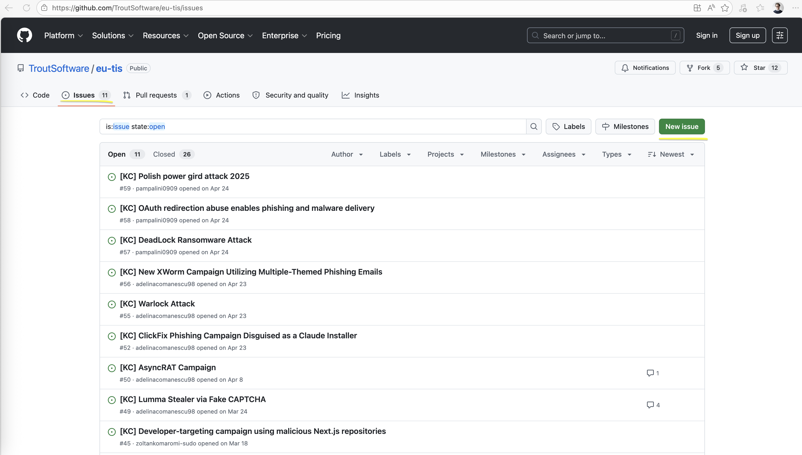
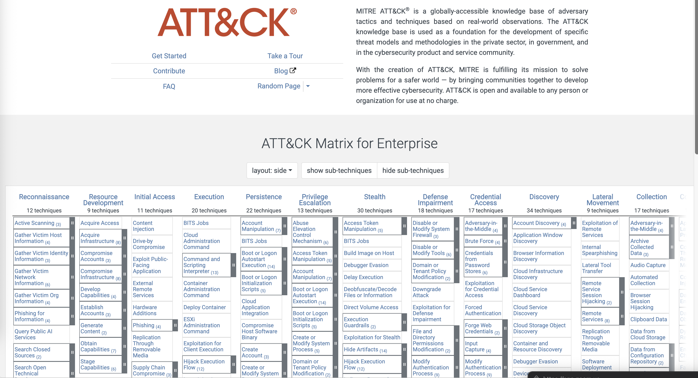
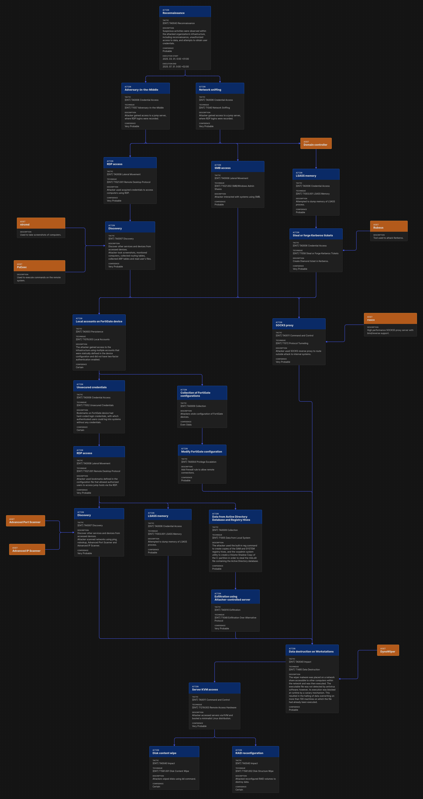

# How to create and share attack data on the SOCCER TIS Platform

## Guide & Education Material

**Date and Version:** V1.0: May 26, 2026

### Authors

* **Zoltán Komáromi**, R&I Technical Delivery Lead, HUN-REN SZTAKI
* **John Hübener**, Cyber Security Analyst, SIGNAL IDUNA Group
* **Anastasia Walter**, Project Coordinator, SIGNAL IDUNA Group

### Contributors

* **Adelina Comanescu**, Cyber Security Analyst, ORANGE ROMANIA SA
* **Romain Doumenc, Basile Charissou**, Trout Software Limited

### Links

* **SOCCER Project website:** [https://soccer.sztaki.hun-ren.hu](https://soccer.sztaki.hun-ren.hu)

---

## 1. Introduction: What is this Guide For?

This guide provides a step-by-step process for creating and submitting cyber-attack flow data to the SOCCER Threat Intelligence Sharing (TIS) Platform.

The SOCCER (Security Operation Centres Capacity building for European Resilience) project, co-funded by the European Union, aims to strengthen Europe’s collective ability to anticipate, detect, and respond to cyber threats. A core component of this initiative is the TIS platform, an open-access repository designed to share high-quality, structured threat intelligence.

By contributing, you help threat hunters, security analysts, and researchers across Europe better understand the nature of specific attacks, test their defences, and build pre-emptive and proactive security measures.

---

## 2. The Contribution Workflow: From Attack Selection to Submission

The process is designed to be transparent and collaborative, using familiar tools like GitHub. 

Here is the workflow at a glance:

1. **Choose an Attack:** Select a relevant cyber-attack or campaign.
2. **Announce Your Work:** Create a GitHub Issue to claim the attack and prevent duplication.
3. **Analyse and Map:** Use the [MITRE ATT&CK®](https://attack.mitre.org) framework to analyse the attack.
4. **Build the Attack Flow:** Visualize the attack sequence using the [Attack Flow Builder](https://center-for-threat-informed-defense.github.io/attack-flow/builder/) tool.
5. **Submit for Review:** Download the flow and submit it via a GitHub Pull Request.

### Step 1: Choosing a Relevant Cyber-Attack

The goal is to analyse attacks that provide valuable, actionable intelligence.

* **Areas of Interest:** We are particularly interested in attacks targeting:
   * Operational Technology (OT) and industrial control systems.
   * Corporate and organizational IT infrastructures.
   * Software development processes and environments (supply chain attacks).
* **Find a Well-Documented Attack:** Search for a recent and well-documented attack. You will need 2-3 independent sources (e.g., cybersecurity blogs, academic papers, official CERT reports) to ensure a comprehensive analysis. These can be found by major players such as Mandiant, the NSA, ENISA, CrowdStrike and others.
* **Check for Duplicates:** Before you begin, please check the existing `killchains/Attack-Flow` directory and the open GitHub Issues in the SOCCER TIS repository to ensure the attack has not already been analysed.

### Step 2: Announcing Your Work (Create a GitHub Issue)

To avoid duplicated effort and inform the community, you must first announce your chosen attack.

1. Go to the SOCCER TIS GitHub Repository: [https://github.com/TroutSoftware/eu-tis](https://github.com/TroutSoftware/eu-tis)
2. Navigate to the **"Issues"** tab and create a **"New issue"**.
3. Use a title like: `Attack Flow Analysis: [Name of Attack/Malware]`.
4. In the description, briefly state your intent to analyse the attack and list the primary sources you plan to use.

---

## Step 3: Analysing the Attack with MITRE ATT&CK®

To ensure a common language, all attack flows must be mapped to the [MITRE ATT&CK®](https://attack.mitre.org) framework.

* **Familiarise yourself with the framework:** Study the ATT&CK Matrix for Enterprise, which is composed of Tactics (the "why" of an adversary's action) and Techniques (the "how").
* **Map the attack:** As you analyse your sources, identify the adversary's actions and map them to the corresponding ATT&CK Tactics and Techniques.

---

## Step 4: Building the Attack Flow

Use the **[Attack Flow Builder](https://center-for-threat-informed-defense.github.io/attack-flow/builder/)**, a free, web-based tool from MITRE, to visualize the attack sequence.

* **Access the Tool:** [https://center-for-threat-informed-defense.github.io/attack-flow/builder/](https://center-for-threat-informed-defense.github.io/attack-flow/builder/)
* **Build the Flow:**
   * Create **Actions** that represent each step of the attack.
   * For each action, add a meaningful **Name** and a detailed **Description**.
   * Map each action to the most specific **ATT&CK Technique** you identified.
   * Connect the actions logically to show the progression of the attack.
* **Fill in Metadata:** In the "Properties" panel on the right:
   * Set the **Name** of the attack flow.
   * Fill in the **Author** field with your name and affiliation.
   * Add links to your analysis sources under **External References**.

> **Important Note:** MITRE ATT&CK Flow Builder can export `.afb` files (Attack Flow Builder only), `.png` files (for compatibility, for example see below) and STIX tools natively within the tool.

### A Note on Using AI

While generative AI can help provide an initial high-level summary of an attack, do not rely on it to create the final attack flow. AI models often hallucinate or misinterpret technical details. Always treat AI-generated output as a rough draft and manually verify every action, description, and connection against your original sources.

*As an example:* GenAI for example can be used effectively to extract high-level information from threat intelligence reports, which usually tend to be extensive (60+ pages).

---

## Step 5: Submitting Your Contribution

Once your attack flow is complete, you can submit it for review.

### Download the Files

1. In the Attack Flow Builder, go to **"File" -> "Save"** to download the attack flow in `.afb` format.
2. Go to **"File" -> "Export" -> "PNG"** to download a visual image of the flow.

### Create a Pull Request

1. Fork the [SOCCER TIS GitHub repository](https://github.com/TroutSoftware/eu-tis).
2. Create a new branch for your contribution.
3. Add your `.afb` and `.png` files to a new folder under the `killchains/Attack-Flow/` directory.
4. Submit a **Pull Request** to the main branch of the Trout Software repository.
5. In the description, link to the GitHub Issue you created in Step 2.

### Review Process

A repository maintainer will review your contribution for accuracy, completeness, and adherence to the standards. They may request changes before merging your work.

**Thank you for contributing to the SOCCER project and helping to enhance cybersecurity resilience across Europe.**

---

### Funding statement

The project is co-funded by the European Union under Grant Agreement No. 101127847 is supported by the European Cybersecurity Competence Centre.

Views and opinions expressed are however those of the author(s) only and do not necessarily reflect those of the European Union or the European Cybersecurity Competence Centre. Neither the European Union nor the European Cybersecurity Competence Centre can be held responsible for them.

### Disclaimer

This guide is provided for informational purposes as part of the SOCCER project. The tools and resources mentioned, such as the Attack Flow Builder, are maintained by their respective owners. The SOCCER project consortium is not responsible for the content of external sites or the functionality of third-party tools.

The information contributed to the TIS platform is provided "as-is" and is governed by the repository's license and data sharing agreement. Users are solely responsible for the content they contribute and for ensuring its accuracy and adherence to all applicable laws and regulations.